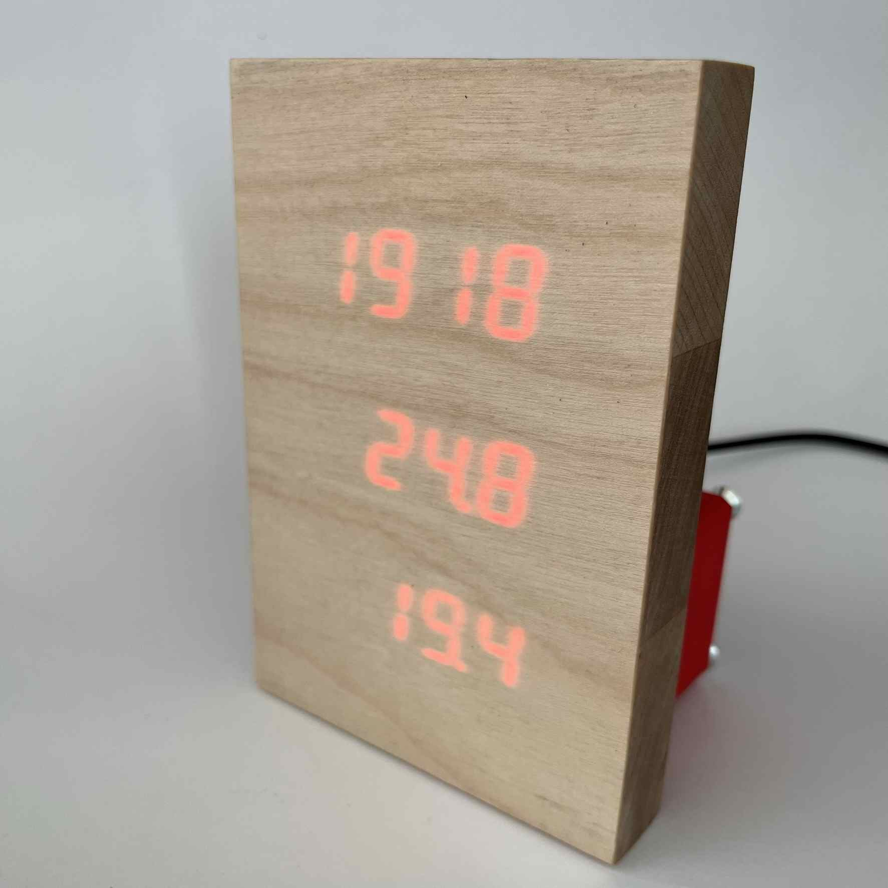
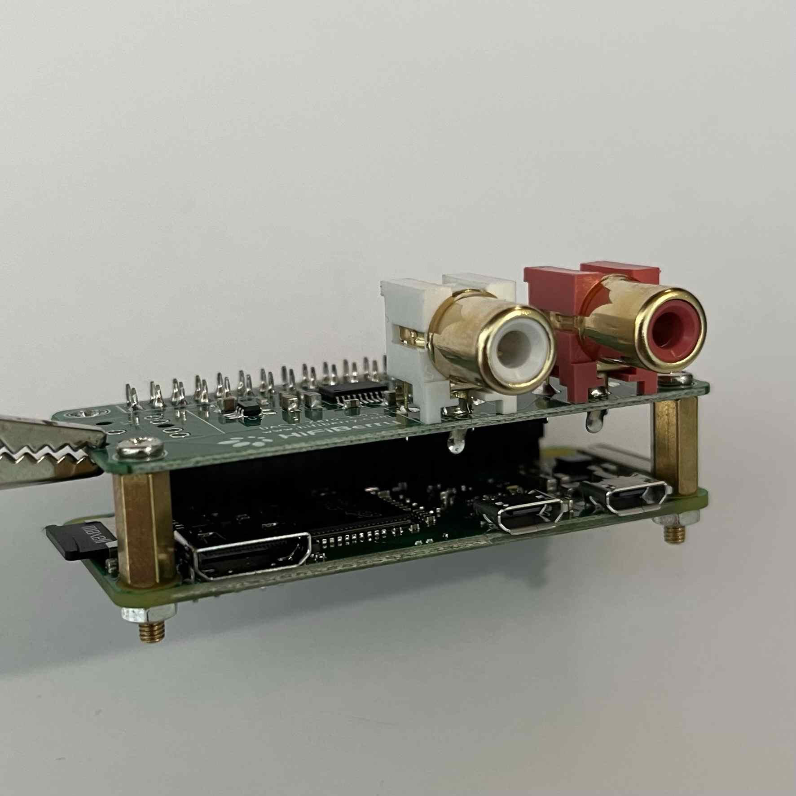
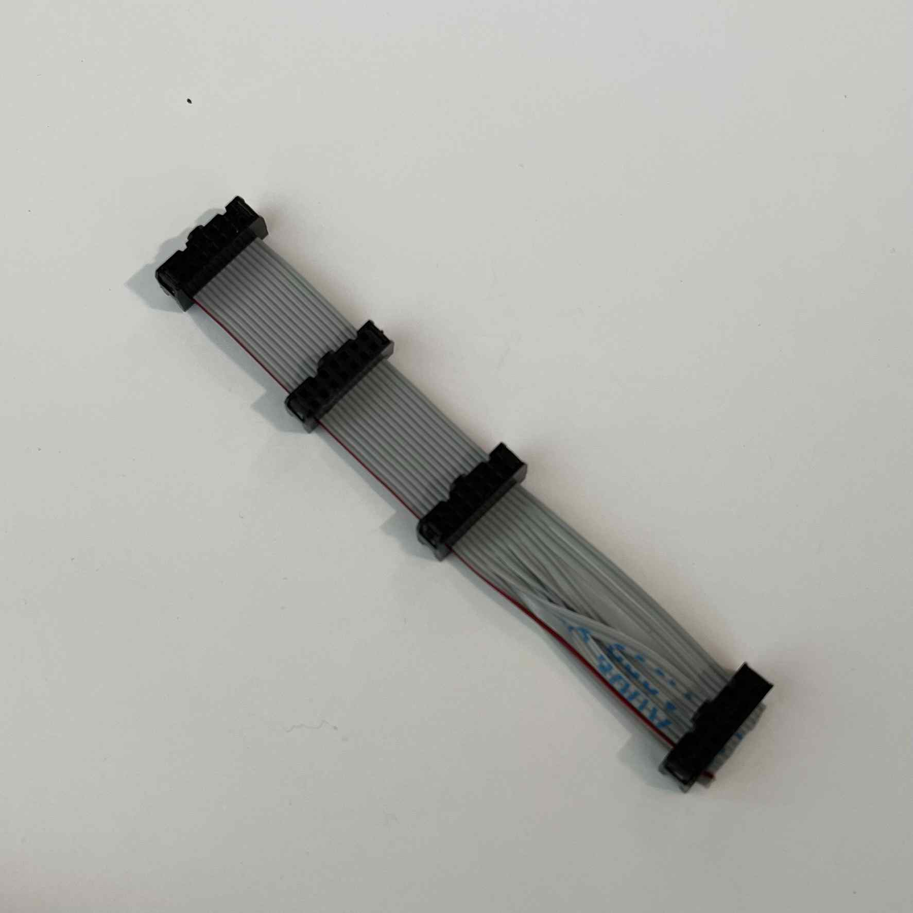
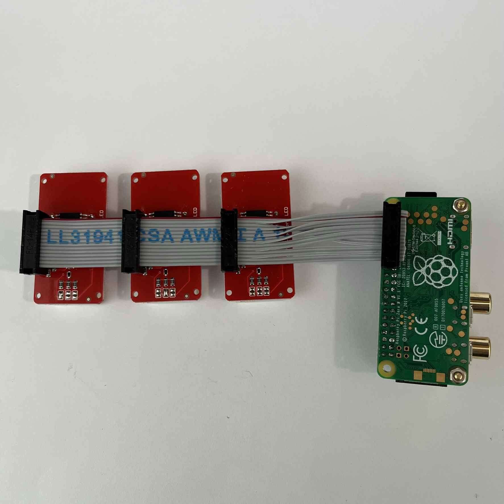
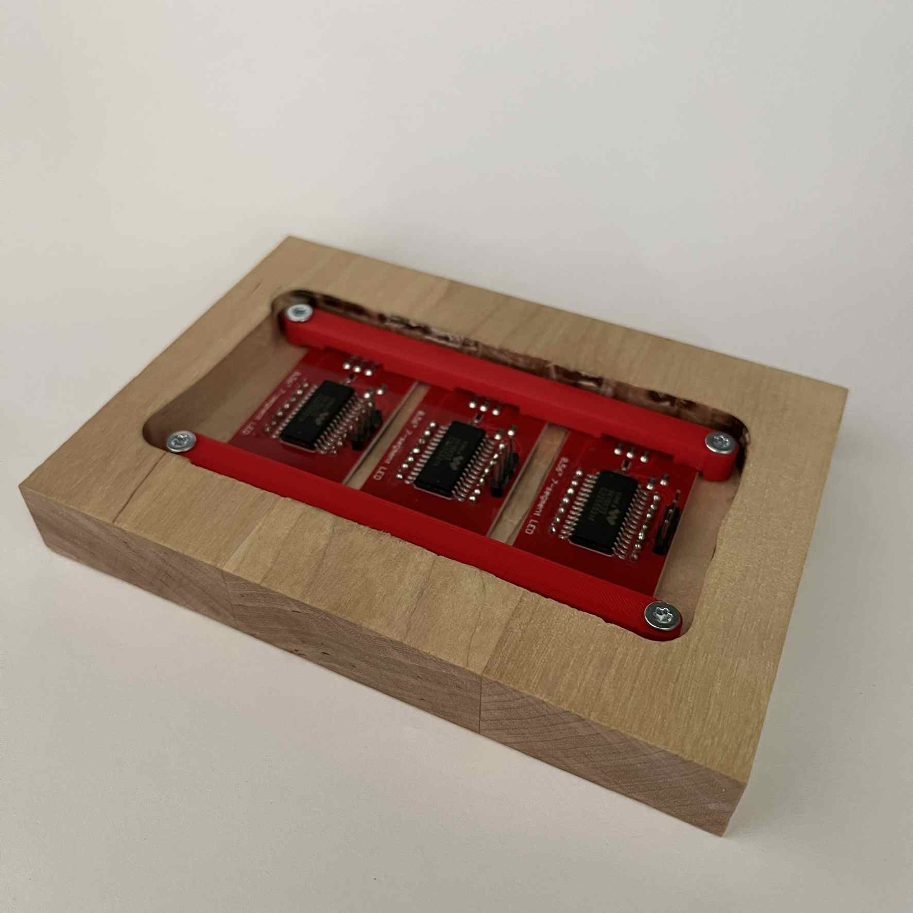
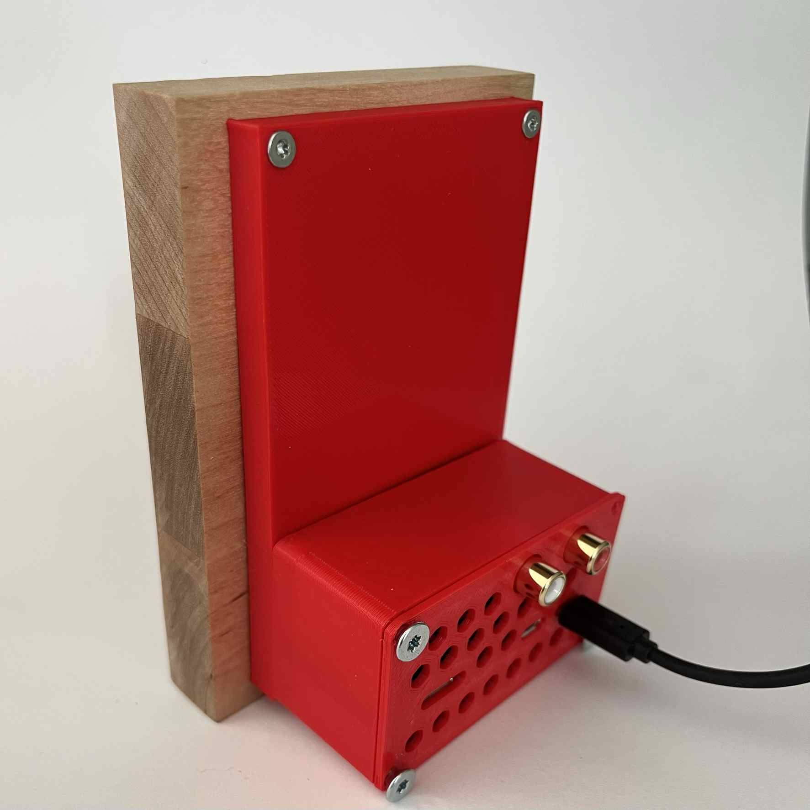

# DIY Thermometer display

The idea for this project was to make a pretty Raspberry Pi zero based clock
and thermometer display.



Temperature readings are fetched from HomeAssistant, and not part of this guide.
The setup includes also audio output for future multi-room audio setup, but
configuring that is not yet a part of this guide either.

## Parts

- [Raspberry Pi Zero W](https://www.raspberrypi.com/products/raspberry-pi-zero-w/)
- 3x [Adafruit 0.56" 4-digit 7-segment display](https://www.adafruit.com/product/878)
- 4x [2x5 Flat ribbon cable connector ](https://www.partco.fi/fi/liittimet/piikkirima-liittimet/lattakaapeliliittimet/8295-pfl10.html)
- 10cm [Flat ribbon cable](https://www.partco.fi/fi/kaapelitjohdot/lattakaapelit/7664-kaa-lat-10.html)
- 130x90x18 mm wood block
- 130x90 mm veneer sheet, must be light colored

Optional:

- [HifiBerry DAC+ Zero](https://www.hifiberry.com/shop/boards/hifiberry-dac-zero/)
- [2x20 Pin header strip with long pins](https://www.partco.fi/fi/liittimet/piikkirima-liittimet/piikkirimat-tuumarasterilla/21492-ch81802va04nhblk.html)
- 11mm spacers

## Woodwork

The idea is to have a wooden block (I used birch) with holes for displays so
that the displays' front side is in the same level as the wood surface. Then
glue a veneer sheet on top of the block so that it looks as if it was a whole block.

Precise dimensions are in Tinkercad: [Thermometer display wood block](https://www.tinkercad.com/things/0Hkc165Q7Bx?sharecode=8FO_0KepIaYrAMIB-PMhNWLmmxWDsxuVGsYca0s0Czc), in a nutshell:

- Wood block outer dimensions: 130x90x18mm
- Holes for displays: 55x20mm
- Holes are 12mm apart from each others
- Inlay is 105x55x10mm

Steps:

1. Do the inlay with a router, 10mm depth must be precise (or if the wood block
   thickness is different, adjust router depth so that there is 8mm of wood left)
2. Drill holes to the corners of where holes for displays will be
3. Do the display holes with a pattern saw
4. Make sure that the display and wood surface are in level
5. Glue the veneer sheet


## 3D-printing

Designs for 3D-printing are in Tinkercad: [Thermometer display](https://www.tinkercad.com/things/30tTfOi6fes?sharecode=TxVxdVy0iR1J2bpMC8Cm7TX_KI9lceQIwGoO33NyMPI).


_Without HifiBerry:_ The case must be modified if it is used without HifiBerry as
the supports that keep Raspberry Pi in place depend on it. Case height can be also
reduced from the bottom as currently there must be space for the flat ribbon cable
connector underneath the Raspberry Pi board.

## Electronics

The setup is a bit unconventional as HifiBerry will be added to the top of Raspberry
Pi and I2C for 7 segment displays to the _bottom_. Because of this, Raspberry must
be a version that doesn't have preinstalled pin header.

First five header pins in Raspberry Pi must be longer than the rest, and extend to the
bottom. In the picture I have seven as 2x5 connectors were unavailable. I also have
two 11mm spacers on the connector side for extra firmness.




Ribbon cable and connectors have a marker for the first pin. For the display
connectors, these should be matched so that the cable goes straight through
three display connectors. Display connectors should be placed with 30mm of
cable between each.

For the last connector, each pair in the ribbon cable must be flipped so that
connection from the first row in display goes to second row in Raspberry, and
pair orders according to the diagram below:

```
 | | | | | | | |
 |v| | | | | | |
+---+---+---+---+---+                    +  3.3V power
| + | - | D | C |   |   Displays         -  ground
+---+---+---+---+---+                    D  I2C1 SDA, data
|   |   |   |   |   |                    C  I2C1 SCL, clock
+---+---+---+---+---+                    v  connector first pin marker
 | | \ \ / / / /                         X  flip the pair
 | |    / / / /
  X     X   X   X
 | |  / / / /   \ \
 |v| / / / /     \ \
+---+---+---+---+---+
|   |   |   |   |   |   Raspberry Pi
+---+---+---+---+---+
| + | D | C |   | - |
+---+---+---+---+---+
```



Each display on I2C bus must have a different address. These are defined with address
selection jumpers that are in the bottom part of displays in the following picture.
First display has the first jumper soldered (I2C address `0x71`), second has the
second (`0x72`) and third doesn't have any (`0x70`).



_Without HifiBerry:_ Cable pairs must not be flipped as the Raspberry Pi connector
will be on the top. The pair ordering must still be according to the diagram.

## Software

It is good to verify that everything works before assembly. Instructions for
installing required software are in
[README.md - thermometer_display.py](README.md#thermometer_displaypy)

## Assembly

1. Displays are held in place with two plastic parts.
   
2. Raspberry Pi goes to the case with ribbon cable coming out from the bottom.
   There are small plastic strips at the bottom, inside the case that keep
   Raspberry Pi in place vertically. SD-card goes to the groove on the side.
   
   
3. Back cover and case are held together with screws. When the cover is at the
   center, the whole display tilts a little backwards.
   
4. And the finished project again!
   
